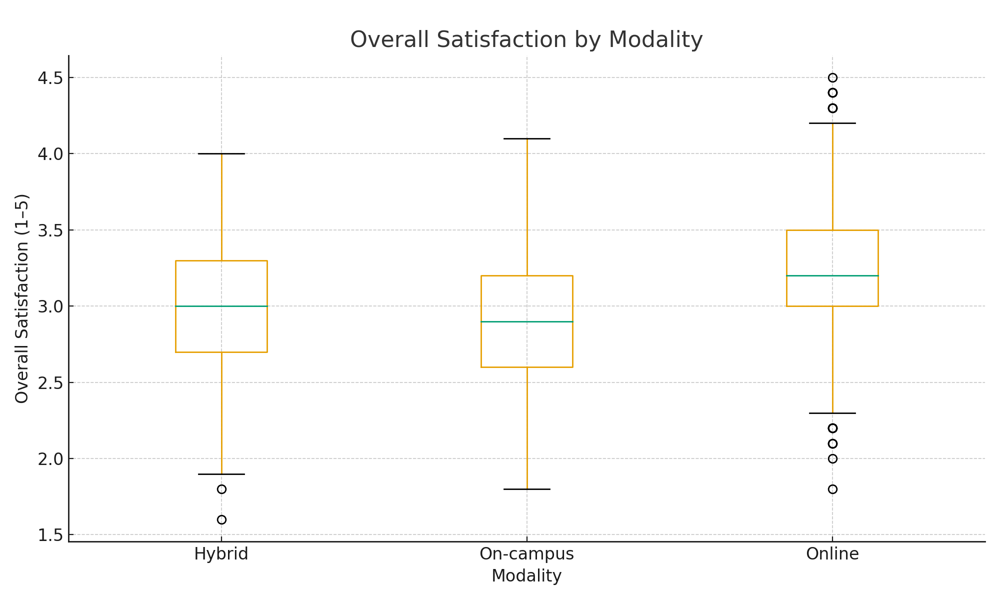
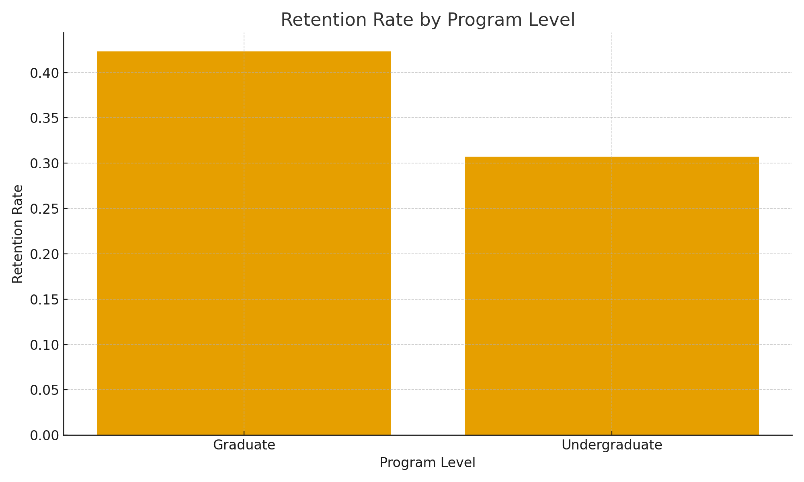
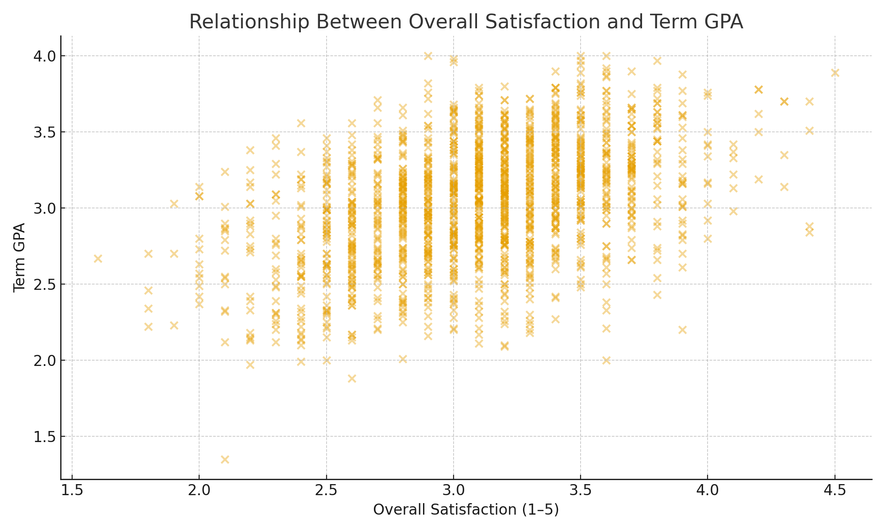

# Higher-Ed Analytics Portfolio (Anonymized)
End-to-end analysis, Dashboards & Automated reporting

  <a class="port-btn" href="{{ site.github.repository_url }}">View on GitHub</a>
  <a class="port-btn" href="#projects">Explore My Projects</a>
  <a class="port-btn" href="{{ '/resume.pdf' | relative_url }}">Download Résumé</a>
  <a class="port-btn" href="https://www.linkedin.com/in/derrick-dzormeku-mba-75288644" target="_blank" rel="noopener">LinkedIn</a>

---

## Professional Summary
> Strategic and customer-centered Data Analyst with over 5 years of experience leading data-driven initiatives. Proficient in Python, SPSS, R, Power BI and Tableau, with a proven record of developing scalable insights that enhance user engagement, satisfaction, and program effectiveness. Experienced in sentiment analysis, survey management, and cross-functional collaboration to drive business impact. Passionate about crafting data solutions that improve experiences and reduce churn.

**Keywords:** data analytics, Python, SPSS, R, Tableau, Power BI, predictive modeling, survey analytics, reporting automation, GitHub Actions, reproducible workflows

---

## Technical Skills
**Programming:** Python, R, SQL  
**Libraries:** Pandas, NumPy, Matplotlib, Seaborn, Statsmodels, scikit-learn  
**Visualization:** Tableau, Power BI, Plotly  
**Workflow:** Git, GitHub Actions, Markdown reporting, reproducible pipelines  
**Statistics:** Descriptives, correlation, regression, ANOVA, predictive modeling  
**Survey tools:** Qualtrics, SPSS

---

## Why this Portfolio?
I turn complex, real-world data into **clear actionable insight for decision making**. Each project shows a reproducible pipeline:
**Raw Data → Cleaning → Analysis/Models → Visualization → Insight → Action.**

---

## Featured Projects  {#projects}

### 1) Student Satisfaction Toolkit (Higher-Ed)
**Context:** Prioritize improvements using anonymized survey data.  
**Tools & techniques:** Python (Pandas, Matplotlib), SPSS, Markdown reporting.  
**Methods:** Descriptives · Likert analysis · Quadrant “importance vs satisfaction” map.  
**Impact:** Clear priorities for resource allocation and weekly insights for stakeholders.  
**Links:** 
- Visual: 
- Cohorts: 
- Weekly report (Markdown): [Open]({{ '/04-reporting-automation/outputs/report.md' | relative_url }})

---

### 2) Microsurvey Pulse (Rapid insights)
**Context:** Quick, frequent pulse checks on key experiences.  
**Tools & techniques:** Python (Pandas), GitHub Actions for auto-refresh.  
**Methods:** Descriptives · Correlation · Simple regression where applicable.  
**Impact:** Moves analysis turnaround from weeks to hours; keeps leaders updated.  
**Links:** 
- Descriptives CSV: [Download]({{ '/desc_stats.csv' | relative_url }})
- Correlation CSV: [Download]({{ '/corr_matrix.csv' | relative_url }})
- Correlation heatmap: 
- Regression results (Markdown): [Open]({{ '/regression_results.md' | relative_url }})

---

### 3) Employer Dataset Cleaning (Data quality)
**Context:** Normalize employer names for reporting and matching.  
**Tools & techniques:** Python (string ops), canonical mapping.  
**Impact:** Cleaned dataset reduces manual cleanup and errors in downstream analytics.  
**Link:** [Cleaned employers CSV]({{ '/employers_clean.csv' | relative_url }})

---

## Statistical Analysis Showcase
**Descriptive Statistics** — ready-to-download tables.  
- [Descriptives CSV]({{ '/desc_stats.csv' | relative_url }})

**Correlation Analysis** — full matrix + visual.  
- [Correlation CSV]({{ '/corr_matrix.csv' | relative_url }}) · 

**Regression Models** — variables, coefficients, *R²*, notes.  
- [Regression Results]({{ '/regression_results.md' | relative_url }})

> All datasets and figures are **anonymized** and reproducible.

---

## Statistical Analysis (full workflow)

This section focuses on student outcomes, satisfaction, and retention.

- **Descriptive statistics (table):** [higher_ed_desc_stats.md](higher_ed_desc_stats.md)  

- **Correlation matrix:** [higher_ed_corr_matrix.md](higher_ed_corr_matrix.md)  

- **ANOVA (year):** [higher_ed_anova_modality_satisfaction.md](higher_ed_anova_modality_satisfaction.md)  

- **OLS (gpa):** [higher_ed_ols_gpa_model.md](higher_ed_ols_gpa_model.md)  

- **Logistic regression:** (retention): [higher_ed_logit_retention_model.md](higher_ed_logit_retention_model.md)

### Key visuals

---

## Certifications & Education
**Certifications:**  
- Google Data Analytics Professional Certificate  
- Google Analytics Individual Qualification  
- WWC Group Design Standard (IES)  
- CITI Program – Social & Behavioral Research (valid)

**Education:**  
- MBA, Business Data Analytics — Mount Vernon Nazarene University  
- MBA, Organizational Management — Mount Vernon Nazarene University  
- BSc, Business Administration (Marketing) — Evangelical Presbyterian University College

---

## Publications & Conferences
- *Devising a Holistic Data Dashboard* – district collaboration for schoolwide improvement  
- *Understanding School Principals’ Perspectives on Using Data*  
- Conference sessions: UCEA (2022 & 2023), AERA (2024)

> Ask me about continuous improvement, assessments, survey measurement, and data-informed culture.

---

## Impact Metrics (examples)
- Automated reporting reduced manual compilation by **10%**.  
- Increased survey response rates by **16%** via process improvements.  
- Cut analysis turnaround from **2 months to 3 weeks** with reproducible workflows.

---

## Contact & links

<a class="port-btn"
   href="https://mail.google.com/mail/?view=cm&fs=1&to=d.double76@icloud.com&su=Portfolio%20inquiry%20%E2%80%93%20Derrick%20Dzormeku&body=Hi%20Derrick,%0D%0A%0D%0AI%27m%20reaching%20out%20about%20your%20analytics%20portfolio.%20Could%20we%20schedule%20a%20brief%20call%3F"
   target="_blank" rel="noopener">
  Email via Gmail
</a>
  <a class="port-btn" href="https://www.linkedin.com/in/derrick-dzormeku-mba-75288644" target="_blank" rel="noopener">LinkedIn</a>
  <a class="port-btn" href="{{ site.github.repository_url }}">GitHub Repo</a>
  <a class="port-btn" href="{{ '/resume.pdf' | relative_url }}">Download Résumé</a>

<small>Site theme powered by GitHub Pages. All datasets shown here are anonymized.</small>
