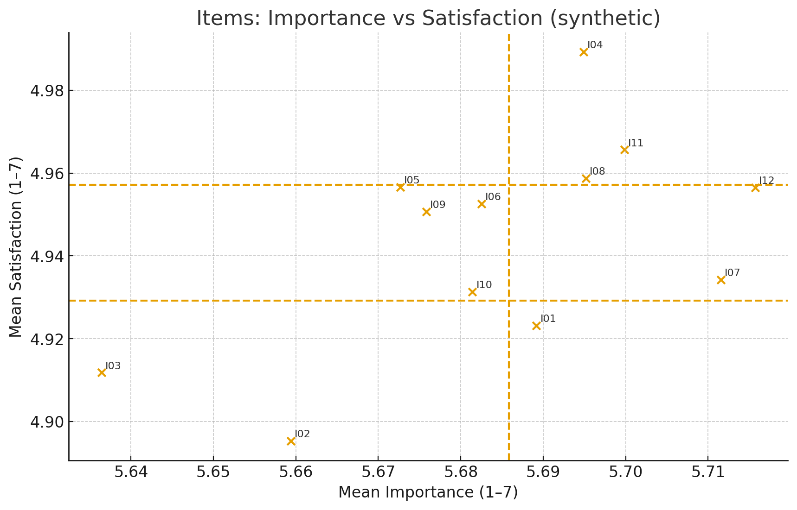
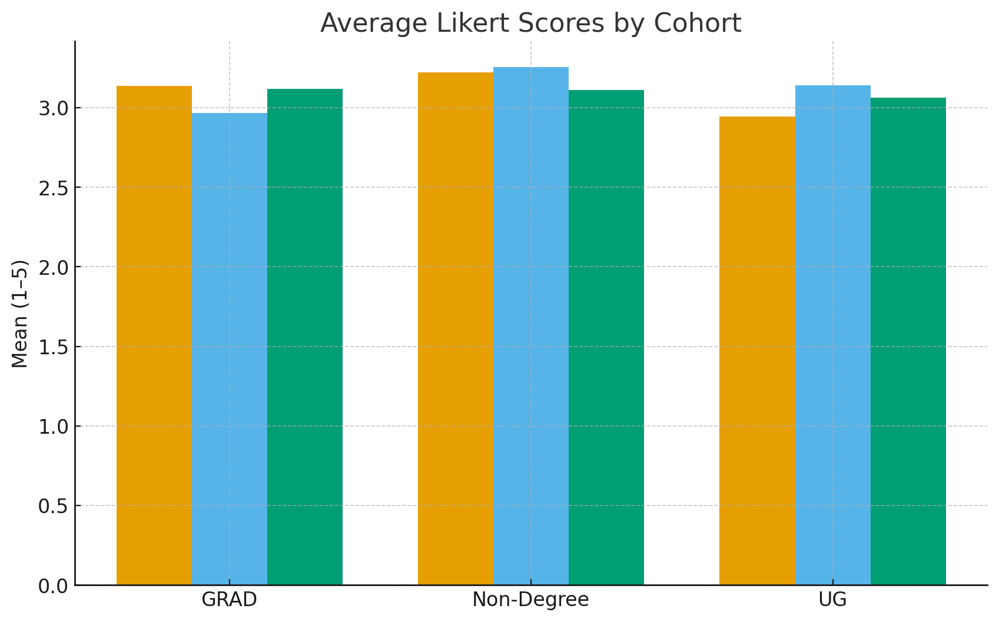

  <h1>Turning Higher-Ed Data into Actionable Insights</h1>
  
From messy sources to clear decisions—cleaning, analysis, and automated reporting.

  

    <a class="btn primary" href="#work">Explore My Projects</a>
    <a class="btn ghost" href="https://github.com/{{ site.github.owner_name }}/{{ site.github.repository_name }}">View on GitHub</a>
    <a class="btn ghost" href="./resume.pdf">Download Résumé</a>
  

  

    
RNL PSOL multi-year analysis

    
SPSS + Python reproducibility

    
Auto weekly Markdown reports

  

## Overview
Imagine messy student surveys and employer lists transformed into decisions leaders can act on.
This portfolio shows how I clean, analyze, and visualize higher-ed data—fast and repeatably.

**Process**: Raw Data → Cleaning → Analysis → Visualization → Insights

---

## Why Higher-Ed Analytics?
- Improve student satisfaction, retention, and time-to-degree.  
- Support accreditation/IPEDS reporting with trustworthy pipelines.  
- Give leaders tight, visual summaries they can use in minutes.

---

## Featured visuals {#work}

  

    <figure>
      
      <figcaption><strong>Satisfaction Map.</strong> Prioritizes gaps between importance and satisfaction to guide resource allocation.</figcaption>
    </figure>
  

  

    <figure>
      
      <figcaption><strong>Cohort Likerts.</strong> Compares item-level satisfaction across student groups to target interventions.</figcaption>
    </figure>
  

See also: <a href="./report.md">Weekly Insights (Markdown)</a> · <a href="./cleaned.csv">Cleaned employers CSV</a>

---

## Mini case study: Data-informed improvement
**Challenge:** Identify the levers behind student satisfaction and convert findings into an executive brief.  
**Approach:** Merged multi-year RNL PSOL responses; built SPSS syntax for recodes; used Python for charts and an automated Markdown report; framed actions with Improvement Science (PDSA).  
**Impact:** Clear, prioritized actions for program leads; reproducible pipeline for semester refreshes.

---

## Statistical analysis

- **Descriptive statistics:** [CSV]({{ '/desc_stats.csv' | relative_url }})
- **Correlation matrix:** [CSV]({{ '/corr_matrix.csv' | relative_url }}) ·
  [Heatmap]({{ '/corr_heatmap.png' | relative_url }})
- **Regression (OLS):** [Results]({{ '/regression_results.md' | relative_url }})

*Runs on anonymized datasets and refreshes via GitHub Actions.*
---

## Skills & Tools

  SPSS Python Pandas Matplotlib
  Tableau SQL Markdown automation
  GitHub Actions Data governance & policy

---

## What I bring to your team
- Data cleaning & reproducibility across SPSS and Python.  
- Survey analytics expertise (Likerts, gap analysis, cohort comparisons).  
- Automated reporting workflows that keep leaders updated weekly.  
- Improvement Science (PDSA) framing to turn insights into practice.

<footer class="small">
  All datasets shown here are anonymized.
</footer>
